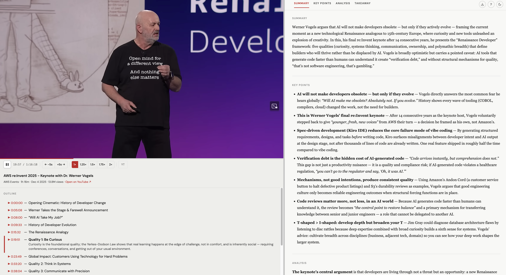

# video-lens

**Turn any YouTube video into a polished research report.**

video-lens is a coding agent skill that fetches a YouTube transcript and generates a structured HTML report — executive summary, takeaway, key points with analysis, timestamped topic outline, and an embedded in-page player.



---

## What you get

- **Executive summary** — 3–5 sentence TL;DR overview
- **Takeaway** — the single most important insight (1–3 sentences)
- **Key points** — bulleted, scannable insights with supporting detail
- **Timestamped outline** — click topics to expand summaries; click timestamps to jump the player
- **In-page YouTube player** — watch while reading; auto-highlights the current section
- **Keyboard shortcuts** — playback speed, layout resize (S/M/L), navigation, and more (`?` for help)
- **Markdown export** — copy the full report as Markdown in one click
- **Dark mode** — auto-detects system preference; remembered across sessions
- **Video gallery** — browse, search, and filter all your saved reports by title, channel, tag, or keyword; shows thumbnails, summaries, and tags at a glance

---

## Requirements

| Tool                                             | Purpose                                                    |
| ------------------------------------------------ | ---------------------------------------------------------- |
| A supported coding agent                         | Runs the skill (see [Supported Agents](#supported-agents)) |
| Python 3                                         | Fetches the transcript                                     |
| **Optional:** [Raycast](https://www.raycast.com) | Trigger from anywhere via hotkey (macOS)                   |
| **Optional:** [Task](https://taskfile.dev)       | Install/dev commands alias (`brew install go-task`)        |
| **Optional:** [Deno](https://deno.com)           | Required by yt-dlp (`brew install deno`)                   |

> **Note:** video-lens only works for videos that have captions/subtitles available. Videos with captions disabled will produce an error. YouTube Shorts are not supported.

---

## Supported Agents

video-lens uses the universal [SKILL.md](https://agents.md/) format — any agent that supports it can run this skill.

[](https://skills.sh/kar2phi/video-lens)

---

## Install

### Option A — skills CLI (recommended)

```bash
npx skills add kar2phi/video-lens
pip install youtube-transcript-api yt-dlp
brew install deno  # optional, needed by yt-dlp
```

Then use `/video-lens <url>` in any supported agent.

### Option B — Manual install (Claude Code, no clone needed)

No repo clone or Task required — just run:

```bash
mkdir -p ~/.claude/skills/video-lens && \
curl -Lo ~/.claude/skills/video-lens/SKILL.md https://raw.githubusercontent.com/kar2phi/video-lens/main/skills/video-lens/SKILL.md && \
curl -Lo ~/.claude/skills/video-lens/template.html https://raw.githubusercontent.com/kar2phi/video-lens/main/skills/video-lens/template.html && \
pip install youtube-transcript-api yt-dlp

# Optional: deno is required by yt-dlp as a JavaScript runtime
brew install deno
```

> **Other agents:** Replace `~/.claude/` with `~/.copilot/`, `~/.gemini/`, `~/.cursor/`, etc. in the commands above. Or use `npx skills add kar2phi/video-lens` to install for all detected agents at once.

### Option C — Full install (with Raycast + dev tools)

#### 1. Clone and install Python dependencies

```bash
git clone https://github.com/kar2phi/video-lens.git
cd video-lens
task install-libraries

# Optional: deno is required by yt-dlp as a JavaScript runtime
brew install deno
```

#### 2. Install the skill

```bash
task install-skill-local
```

#### 3. (Optional) Install the Raycast script for Claude

```bash
task install-raycast AGENT=claude
```

Requires Raycast. The script opens a new iTerm2 tab (or Terminal.app if iTerm2 isn't installed), launches Claude with the required permissions, and runs the skill.

---

## Usage

### In Claude Code

```
/video-lens https://www.youtube.com/watch?v=...
```

Claude fetches the transcript, generates the report, and opens it in your browser at `http://localhost:8765/`.

### Gallery

Browse, search, and filter all your saved reports by title, channel, tag, or keyword:


After generating reports, open the gallery:

```
/video-lens-gallery
```

Or rebuild the index manually:

```bash
task build-index
```

The gallery opens at `~/Downloads/video-lens/index.html`.

### Via Raycast

Invoke the **video-lens** command, paste a YouTube URL (or leave blank to use the clipboard), and choose a model (default: Sonnet). The report opens automatically in your browser.

Reports are saved to `~/Downloads/`.

---

## Dev server

To iterate on `skills/video-lens/template.html` without running a real video:

```bash
task dev
```

Opens a rendered sample report at `http://localhost:8765/sample_output.html`.

---

## Repo layout

```
video-lens/
  skills/
    video-lens/
      SKILL.md          ← skill prompt (source of truth)
      template.html     ← HTML report template (source of truth)
    video-lens-gallery/
      SKILL.md          ← gallery skill prompt (source of truth)
      index.html        ← gallery viewer (source of truth)
      scripts/
        backfill_meta.py  ← backfills meta blocks into old reports
        build_index.py    ← builds manifest.json and copies index.html
  scripts/
    raycast-video-lens.sh ← Raycast script (source of truth)
    yt_template_dev.py← Dev server helper
  Taskfile.yml
  requirements.txt
```

**Always edit files in this repo, then deploy with `task install-skill-local AGENT=claude` and `task install-raycast AGENT=claude`.** Never edit directly in `~/.{agent}/skills/` or `~/.raycast/scripts/`.

---

## Contributing

PRs welcome. Keep the skill prompt in `skills/video-lens/SKILL.md` and the HTML template in `skills/video-lens/template.html` — those are the sources of truth.

## License

MIT
